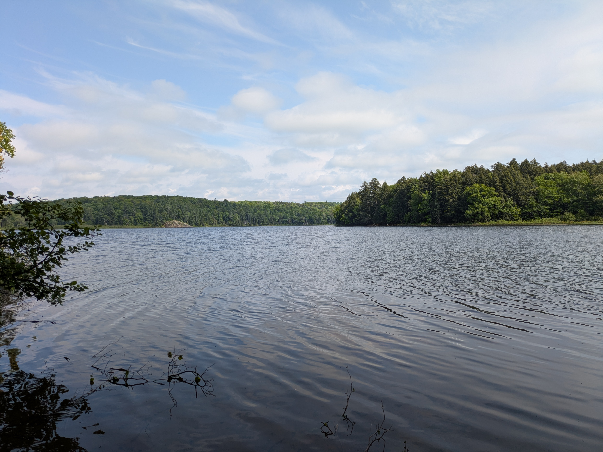
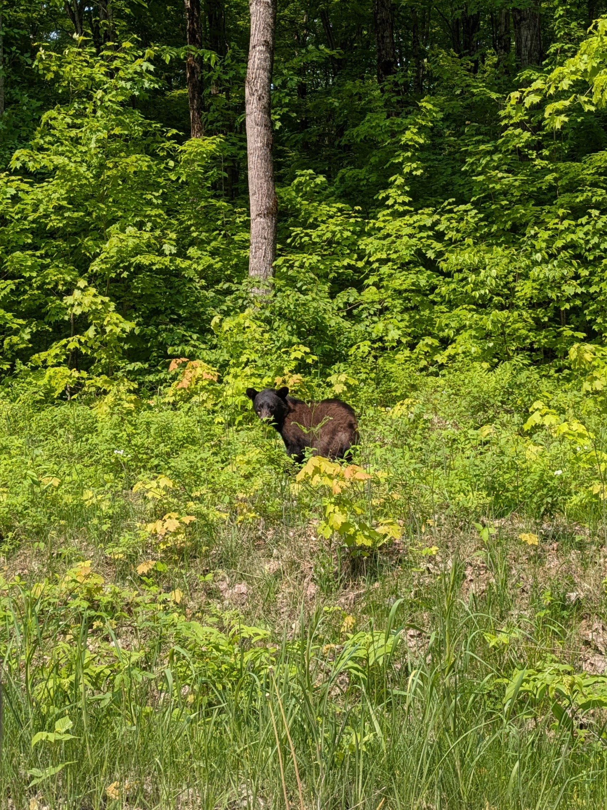

# June 2025 - Upper Peninsula, Michigan
Photos from my solo camping trip in June 2025 to the Upper Peninsula of Michigan.

It is recommended that you listen to the (obligatory) classic song ["Waterfalls" by TLC](https://www.youtube.com/watch?v=R09S7CNPhFs&list=RDR09S7CNPhFs&start_radio=1) for the best viewing experience.

    Note: It make take the page ~30 seconds to fully load all ~85 pictures.

## Black Bear Spottings: `2`
1. From the car as pictured in [Chapel Falls](#chapel-falls)
2. On the `Upper and Lower Tahquamenon Falls` at [Tahquamenon Falls State Park](#tahquamenon-falls-state-park)

## Album Cover
    Q: How did you take this?
    A: No, I would not talk to someone. Instead I balanced rocks against my phone and used the timer.

## Driving & Route
- Google Maps [destination locations](https://maps.app.goo.gl/4R2HD3p8fWdf19F46)

### Route Map
- About `1200 miles`
- About `22 hours`

### Scenic Roadways
- Quiet. No traffic. Very scenic and peaceful driving throughout the area.
- Road conditions were typically excellent!

## Porcupine Mountains a.k.a. the Porkies

### Bond Falls
- Great start to the trip
- Short walk to stretch the legs after the ~4 hour drive
- There is a hydroelectric power site near the top of the falls ran by Upper Peninsula Power Company

### Agate Falls
- Tree leaves covered the view of the large falls
- The site is a roadside park and has an under bridge walkway to get to the falls
    - The graphitti under the bridge included a great quote from the movie `The Princess Bride`
        - *Hello. My name is Inigo Montoya. You killed my father. Prepare to die*
    - The graphitti also told me to call [*Jenny*](https://www.youtube.com/watch?v=6WTdTwcmxyo) at `867-5309`, so basically I got a girl's number.
        - *"I saw your name and number on the wall"*

### O Kun de Kun Falls
- This trail includes both the `O Kun de Kun Falls` and the `Konteka Falls`
- There was a logbook located at the suspension bridge by `O Kun de Kun Falls` that was an interesting read.

### Konteka Falls
- The *Witch Tree or Spirit Tree* (where a tree roots grow out over rocks and open water) was prominent
    - [Wikipedia *Witch Tree*](https://en.wikipedia.org/wiki/Witch_Tree)

### Presque Isle State Park

#### Lake Superior
- There was one suprsingly calm evening where the waters of `Lake Superior` were still. I took this opportunity to skip rocks as the rocky beaches are full of perfect skipping stones!

#### Campsite
- The campsite butted up against `Lake Superior`. However, there was a hundred foot bluff that prevented easy lakefront access.
    - There was a wooden staircase that brought you down to the lake
- Hot meals were primarily cubed potatoes, diced onions, scrambled eggs, and seasonings (garlic salt, red pepper flakes, garlic powder, topped with parsley) fried in butter.

### Manido Falls

### Manabezho Falls
- The downriver falls (second photo) was taken from a suspension bridge over the river.
- The left hand side of the photo shows circular rock erosion where the water spins around in a whirpool fashion

### Little Carp River
- TBD on the fish identification. Could be sort sort of `bullhead`

### Lake of the Clouds
- `Lake of the Clouds` is the most popular destination in the Porcupine Mountains

### North Mirror Lake
- `North Mirror Lake` had two rental cabins with provided canoes accessible via backpacking.
- The lowlands between the mountains were swampy and had long boardwalks, with many `garter snakes` sunbathing on the planks.

### Summit Peak Observation Tower
- Probably a better view in the fall vs the spring! I stole from photos from online to show what that would look like.

### Trappers Falls
- `Trappers Falls` is about a quarter of the way up the hike from the trailhead to `Government Peak`

### Government Peak
- Peak elevation is `1850` feet
- Not a great view from the top in summer. Tree coverage makes the sweeping lanscape views difficult to see through the thick leaves.
- Would be a cool backpacking site as there is a campsite on the peak

## Copper Harbor
- It was almost the summer solstice, so being this far north meant daylight well past `10:15pm EST`!

### The Elusive Montreal Falls
- My white whale. Google maps reported the trailhead about 15 miles into a seasonal ATV road.
- I never did make it to the `Montreal Falls`, but I gave the Corolla some off road experience.

## Pictured Rocks National Lakeshore

### Upper Overlook

### Miners Falls & Beach

### Chapel Falls
- Best hike of the trip!
    - Diverse biomes along the hike
    - Perfect hiking weather: `60° F` with a breeze from `Lake Superior`
    - Combination of waterfalls, beaches, woodlands, and rock cliffs on the lakeshore
    - Captured a photo of a `black bear` on the drive into the trailhead!

### Mosquito Falls
- Way less mosquitos than the name implies. Could be an Iceland/Greenland situation to scare people off.

### North Gemini Lake (State Forest Campground)
- Bring your bugspray. The mosquito to human ratio at my campsite was roughly `1,000 mosquitoes : 1 Caleb`
    - Maybe this place should have been named `Mosquito Lake`

### Log Slide Overlook
- The `Logslide Overlook` was a ~300 feet vertical dropoff made solely of windblown sand. A hike down might take a few minutes, but a hike back up the sandy slope was estimated at a few hours.
    - I went down `1/4th` of the way and found it took about `5 full minutes` to get back to the top. I imagine it would have taken almost an hour to do the entire climb.

### Lake Superior Overlook
- Just a typical `41° F` beach day in June! Wind chill factor made the winter hat and coat mandatory.

## Tahquamenon Falls State Park

### Upper Falls

### Lower Falls

### River Trail: Upper and Lower Tahquamenon Falls
- Park signs claimed this was a round trip `5 hour` hike (`8 miles` total for out and back). I took this as a challenge and completed the hike in just over `2.5 hours`.
- Hey bear! I met the same number of **bears** on the hike from the Upper to the Lower falls as humans `(1)`.

## Kitch-iti-kipi a.k.a. *The Big Spring*
- The water from the underground spring can be seen inflowing and agitating the sand in the **video** below. 
    - It is a constant `45° F`!
    - `10,000` gallons of water per minutes
- The spring feeds into `Indian Lake`
- `Lake trout` can be seen in the water below when on the observation raft
- [DNR information site](https://www2.dnr.state.mi.us/parksandtrails/details.aspx?id=425&type=SPRK)

<video width="640" height="480" controls>
  <source src="personal_photos/Kitch-iti-kipiSprings.mp4" type="video/mp4">
</video>

## Hiking Trails Overview
| Trail Name                                                 | Location                                   | Mileage (Round Trip) | AllTrails Link |
|------------------------------------------------------------|--------------------------------------------|-----------------------|----------------|
| Bond Falls                                                | Bond Falls Scenic Site                     | 1.0 miles             | [AllTrails](https://www.alltrails.com/trail/us/michigan/bond-falls) |
| O Kun de Kun Falls                                        | Ottawa National Forest                     | 2.8 miles             | [AllTrails](https://www.alltrails.com/trail/us/michigan/o-kun-de-kun-falls-loop) |
| West River Trail and East River Trail Loop                | Porcupine Mountains Wilderness State Park  | 2.7 miles             | [AllTrails](https://www.alltrails.com/trail/us/michigan/west-river-trail-and-east-river-trail-loop) |
| Little Carp River Trail                                   | Porcupine Mountains Wilderness State Park  | 6.4 miles             | [AllTrails](https://www.alltrails.com/trail/us/michigan/little-carp-river-trail) |
| Lake of the Clouds                                        | Porcupine Mountains Wilderness State Park  | 1.8 miles             | [AllTrails](https://www.alltrails.com/trail/us/michigan/lake-of-the-clouds) |
| North Mirror Lake                                         | Porcupine Mountains Wilderness State Park  | 6.6 miles             | [AllTrails](https://www.alltrails.com/trail/us/michigan/big-carp-river-correction-line-and-north-mirror-lake-loop) |
| Summit Peak Observation Tower                             | Porcupine Mountains Wilderness State Park  | 1.0 miles             | [AllTrails](https://www.alltrails.com/trail/us/michigan/summit-peak-observation-tower) |
| Government Peak Trail                                     | Porcupine Mountains Wilderness State Park  | 9.2 miles             | [AllTrails](https://www.alltrails.com/trail/us/michigan/government-peak-trail--4) |
| Miners Castle and Miners Beach                            | Pictured Rocks National Lakeshore          | 3.0 miles             | [AllTrails](https://www.alltrails.com/trail/us/michigan/miners-castle-and-miners-beach) |
| Mosquito Falls and Chapel Falls via Chapel Loop           | Pictured Rocks National Lakeshore          | 10.4 miles            | [AllTrails](https://www.alltrails.com/trail/us/michigan/mosquito-falls-and-chapel-falls-via-chapel-loop) |
| Miners Falls Trail                                        | Pictured Rocks National Lakeshore          | 1.2 miles             | [AllTrails](https://www.alltrails.com/trail/us/michigan/miners-falls) |
| Au Sable Point Lighthouse (from Logslide Overlook)        | Pictured Rocks National Lakeshore          | 4.0 miles             | [AllTrails](https://www.alltrails.com/trail/us/michigan/au-sable-point-lighthouse-from-au-sable-point-campground) |
| Upper and Lower Tahquamenon Falls                         | Tahquamenon Falls State Park               | 10.2 miles            | [AllTrails](https://www.alltrails.com/trail/us/michigan/upper-and-lower-tahquamenon-falls) |

### Trail Maps
- [Bond Falls](trail_maps/BondFalls.pdf)
- [Porcupine Mountains State Park](trail_maps/PorcupineMountainsStatePark.pdf)
- [Pictured Rocks National Lakeshore](trail_maps/PicturedRocksNationalLakeshore.pdf)
- [Tahquamenon Falls State Park](trail_maps/TahquamenonFallsStatePark.pdf)
- [Kitch-iti-kipi](trail_maps/Kitch-iti-kipi.pdf)